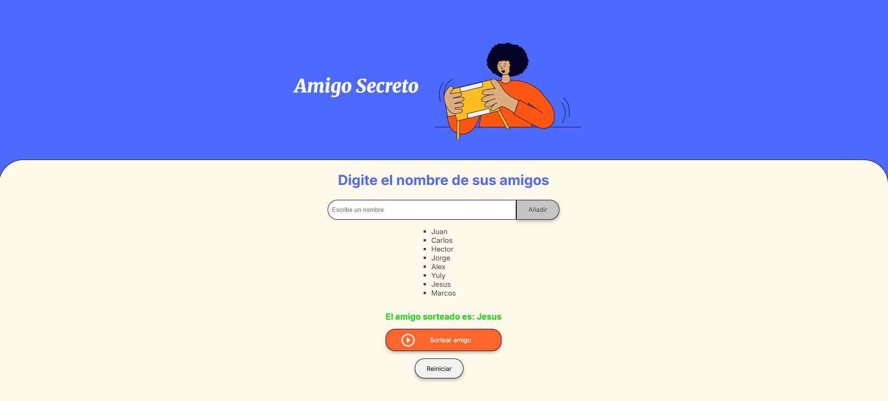

<h1>CHALLENGE AMIGO SECRETO :gift:</h1>
<p align="left"> 
 
</p>

## :pushpin: Descripción

Este proyecto permite a los usuarios agregar nombres a una lista y seleccionar aleatoriamente a uno de ellos como el "Amigo Secreto". Además, incluye funciones para eliminar la lista y mejorar la experiencia del usuario.

## 🚀 Funcionalidades

✅ **Agregar amigos**: Se pueden ingresar nombres en un campo de texto y agregarlos a la lista.  
✅ **Añadir con Enter**: También es posible agregar nombres presionando la tecla Enter.  
✅ **Validación de texto**: Solo se permiten nombres (sin números ni caracteres especiales).  
✅ **Sortear un amigo**: Se elige un amigo aleatoriamente de la lista.  
✅ **Reiniciar el juego**: Se puede limpiar la lista y empezar de nuevo.  

## :art: Tecnologías utilizadas

- **HTML5**: Para la estructura de la página.  
- **CSS3**: Para el diseño y estilos.  
- **JavaScript (ES6)**: Para la lógica del sorteo y manipulación del DOM.  

## :camera: Captura de Pantalla



## 📥 Instalación y Uso :globe_with_meridians:

1. Descarga o clona este repositorio:
   ```bash
